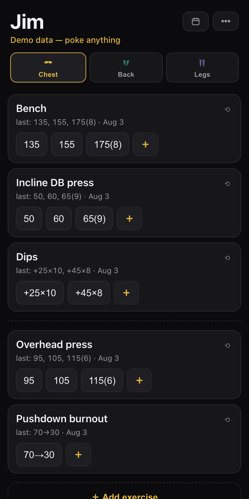
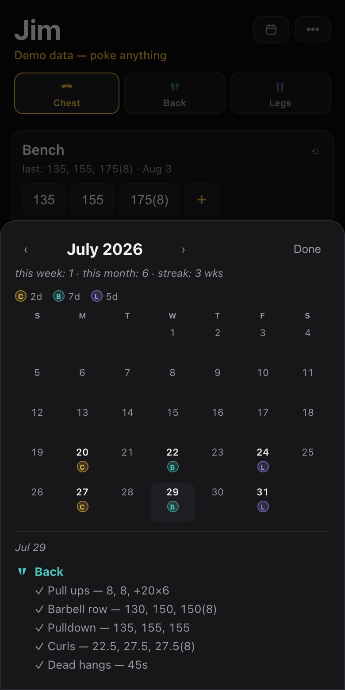

# Jim

A local-first workout tracker, built to replace the Apple Note I'd been logging lifts in for ~8 years.

It keeps the habit that actually works — one screen per training day, current working weights, edited in place —
and fixes the thing Notes couldn't do: every edit is quietly versioned, so the history accumulates instead of
being overwritten.

**[Try the live demo](https://ryonsabouni.github.io/jim/?demo)** — invented data, fully interactive, sandboxed
from real storage.

<p>
  
  
</p>

## Why not a normal workout app

The note is edited, not appended. Nobody wants to "start a workout session" and tap through a wizard mid-set.
The app mirrors the note: exercises with their current weights, tap a number to change it. History happens for free.

## Features

Vanilla JS + IndexedDB. No build step, no dependencies, no server, no accounts.

- Training days as tabs, with anatomical glyphs in a per-day colour
- Sets shown in the note notation — `70(8)`, `+45×8`, `70→30`, `60s`
- Tap a set to edit; long-press a card for **complete**, **bump** (the ladder advances one rung),
  **move**, **undo today**, **rename**, **remove**
- Add an exercise by typing a note line: `Bench 60, 65, 70(8)`
- `last: 60, 65, 70(8) · Jul 22` on every card, with a ↑ hint when the previous session hit the rep target
- Check-offs during the workout; they reset each morning but feed a permanent training diary
- Calendar: coloured chips per training day, `this week · this month · streak`, days-since strip,
  tap a date for the full session
- Backup to a dated JSON via the share sheet (append it to a note as a new attachment each time —
  old restore points stay alive), restore from file or pasted text, note-format export
- Installable PWA: offline service worker, network-first so updates arrive on the next online launch

The app ships **empty**: no program is embedded in the source. First run offers a restore from a
backup file (or a from-scratch start); program and history live in local storage and in backups
the owner keeps, never in this repo.

## Notation

Bare weight means the usual rep target was hit; parentheses record a session that missed it.

| Written | Means |
| --- | --- |
| `60, 65, 70` | three sets, one weight each, target reps |
| `70(8)` | 70 for 8 reps — under target |
| `+45x8` | bodyweight plus 45, 8 reps |
| `70→30` | drop set |
| `60s` | timed set |

The same grammar powers **Add exercise** — type a line, get an exercise.

## Running it

```
python3 devserver.py
```

Then open http://localhost:8743 — or append `?demo` for the sandbox with invented data.
The dev server exists only to serve the files with no-store headers; the app itself is static.

## Layout

```
index.html, style.css, app.js   the app
manifest.webmanifest, sw.js     PWA shell (service worker is network-first, cache fallback)
icon-*.png, apple-touch-icon…   app icons, generated — do not edit by hand
devserver.py                    local static server
docs/                           README screenshots (captured from the demo)
mockup-*.html                   design comparisons (not part of the app)
tools/gen_*.js                  node generators for the mockups and the icon
```

Mockups and icons are generated — edit the generator in `tools/` and re-run it, don't hand-edit
the output. Mockups are deliberately JavaScript-free so they render in any viewer. To regenerate
icons after changing `tools/gen_icon.js`:

```
node tools/gen_icon.js
sips -z 512 512 tools/icon-1024.png --out icon-512.png
sips -z 192 192 tools/icon-1024.png --out icon-192.png
sips -z 180 180 tools/icon-1024.png --out apple-touch-icon.png
```
